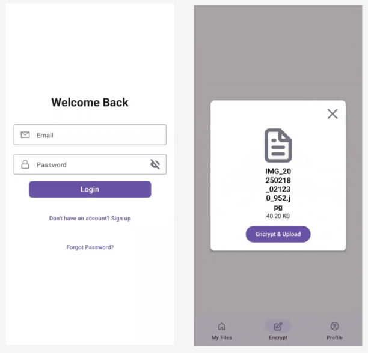

# File Encryptor - Secure File Storage Mobile App

## Overview

This is a React Native mobile application that allows users to securely store and manage their files. The app provides end-to-end encryption for all uploaded files, ensuring that sensitive data remains protected at all times. Users can upload, download, and manage their encrypted files through an intuitive interface.
It supposed to be connected to Firebase for authentication and file storage. This project was made specifically for mobile development course and have to be enhanced before real usage.

## Features

- **User Authentication**: Secure login and registration system
- **End-to-End Encryption**: Files are encrypted before upload and decrypted after download
- **File Management**: Upload, download, and delete files
- **File Library**: View all your encrypted files in one place
- **Cross-Platform**: Works on both iOS and Android devices

## Screenshots




## Demo

View the complete DEMO in [Link](https://drive.google.com/file/d/1ZnDmOFlc1wLWwRAWP5lAL8o16_eLpF7N/view?usp=sharing).


## Tech Stack

- **React Native**: Cross-platform mobile application framework
- **Firebase**: Authentication, Firestore database, and Cloud Storage
- **React Navigation**: Navigation between screens
- **React Native Paper**: UI components
- **Redux**: State management
- **React Native FS**: File system access
- **React Native Document Picker**: File selection
- **Custom Encryption Service**: File encryption/decryption using RNEncryptionModule

## Project Structure

```
src/
├── assets/            # Static assets (images, fonts)
├── components/        # Reusable UI components
│   └── fabrics/       # Component factories
├── constants/         # App constants
├── controllers/       # Business logic controllers
├── redux/             # Redux store and slices
├── screens/           # App screens
├── services/          # Service layer (Firebase, encryption, etc.)
└── App.tsx            # Main application component
```

## Controllers

- **AuthController**: Handles user authentication (login, registration)
- **FileController**: Manages file operations (upload, download, delete)

## Services

- **encryptionService**: Handles file encryption and decryption
- **firebaseService**: Interacts with Firebase (auth, storage, firestore)
- **permissionRequests**: Handles permission requests
- **storageService**: Manages local storage operations

## Screens

- **WelcomeScreen**: Initial app screen
- **LoginScreen**: User login
- **RegisterScreen**: New user registration
- **EncryptionScreen**: File selection and encryption
- **LibraryScreen**: View and manage encrypted files
- **ProfileScreen**: User profile management

## Installation

1. Clone the repository
   ```
   git clone https://github.com/justndev/file-encryptor.git
   cd file-encryptor
   ```

2. Install dependencies
   ```
   npm install
   ```

3. Set up Firebase
   - Create a new Firebase project at [Firebase Console](https://console.firebase.google.com/)
   - Enable Authentication, Firestore Database, and Storage
   - Download the `google-services.json` (Android) and/or `GoogleService-Info.plist` (iOS) and place in the appropriate directory
   - Update Firebase configuration in `firebaseConfig.js`

4. Run the application
   - For Android: `npx react-native run-android`
   - For iOS: `npx react-native run-ios`

## Usage

1. **Registration**: Create a new account with email and password
2. **Login**: Sign in with your credentials
3. **Upload Files**:
   - Navigate to Encryption Screen
   - Select a document from your device
   - Encrypt and upload the file
4. **View Files**:
   - Navigate to Library Screen
   - View all your encrypted files
5. **Download/Delete Files**:
   - Tap on a file to view options
   - Download to decrypt and save to your device
   - Delete to remove the file from storage

## Security

- All files are encrypted on the client side before upload
- Encryption keys are securely stored in Firestore
- Files remain encrypted in cloud storage
- Decryption happens only on the client device after download


## License

This project is licensed under the MIT License - see the LICENSE file for details.
